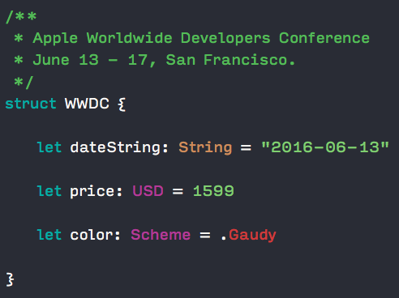

# WWDC2016-Xcode-Color-Scheme
A color scheme for Xcode based on the WWDC 2016 invitation.

## Preview

## Installation Instructions

1. Clone or [download](https://github.com/cargath/WWDC2016-Xcode-Color-Scheme/archive/master.zip) the repository.
2. Move the .dvtcolortheme file to your Xcode themes folder (`~/Library/Developer/Xcode/UserData/FontAndColorThemes`).
3. Restart Xcode.

## Changelog

- 1.0 Original version
- 1.1 Added a version with improvements for real-world coding proposed by [Sergej Jaskiewicz](https://github.com/broadwaylamb)
- 2.0 Added a completely revamped version that tries to stick more closely to the (wildly incosistent) coloring used by Apple. Also there are 3 themes (two to accommodate different user preferences and one used on Apples slides at WWDC16) with 3 different tones (one taken directly from the WWDC16 page, one uses the colors Apples WWDC API returns for the different tracks and one inspired by the new Xcode 8 "Civic" theme) now.
